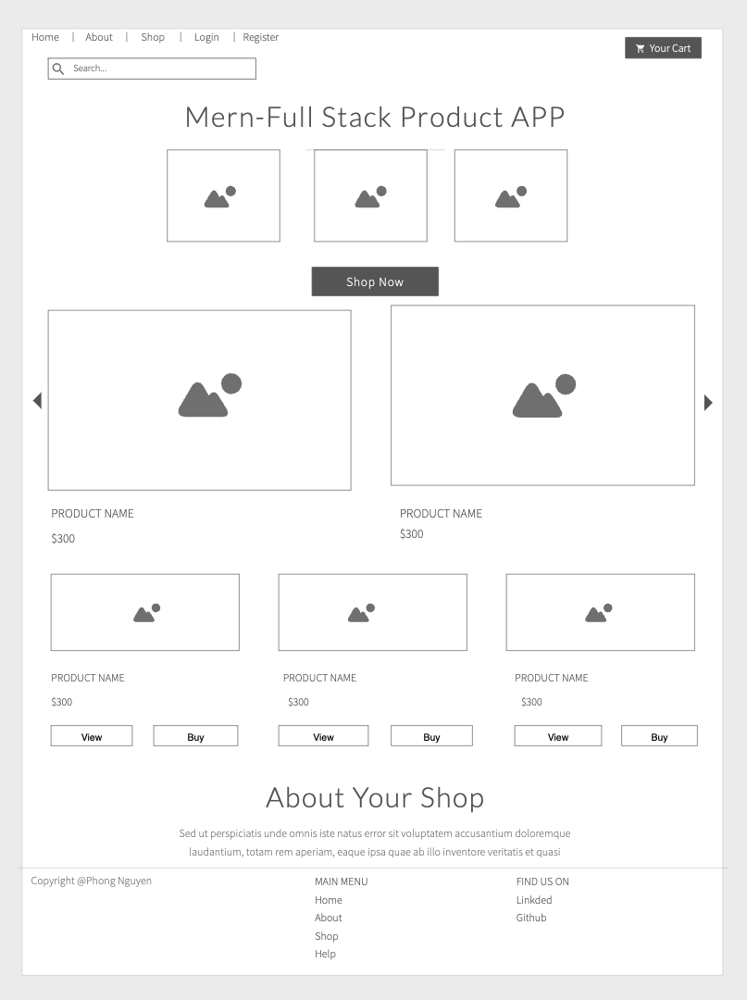
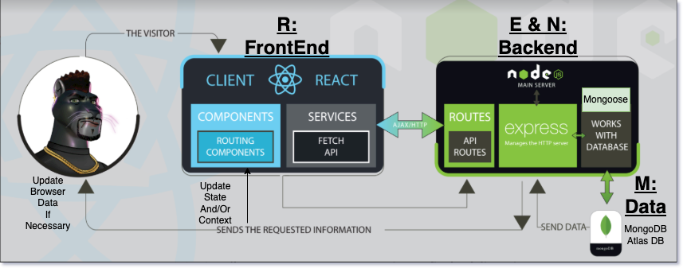

## `A Single-Page-Application(SPA) - MERN((MongoDB, Express, React and Node)) Full Stack .`

### DESCRIPTION

```js
we are using Full Stack JavaScript to design and develop our applications. 
This means we would be using Node, Express and MongoDB to design the REST APIs and then we would use those APIs in our React frontend.
```

### Website Details 
```js
This products website is a continuation from ProductsApp (project #2): 
So, the features we would be having in the application that we would be building are:
  * Node provides the backend environment for this application
  * Authentication using JSON Web Tokens (JWT).
  * Option to add, edit, view and delete all the items in our store.
  * Option to add items or remove items from the cart.
  * Mongoose schemas to model the application data
  * React for displaying UI components
  * Adding Filter, Pagination, Search
  * Adding Shopping Cart
  * Handle Checkout & Payments
  * Deployment heroku
  * Using Cloudinary API & url to upload images
  
Users & Admins Control:
1. USER:  browse the store categories, products, brands add cart and payment.
2. ADMIN:  Manage & Control the entire store components.
```
### Demo
This application is deployed on Heroku. Please check it out :smile: [here](link).

### Wire-frame



### Run the application for development
```
Back-end
$ npm run dev - http://localhost:3001/

```
### Run the application for production
```
Front-end
$ npm run start:dev - http://localhost:3000/
```


### Languages & Technologies 

- [Node](https://nodejs.org/en/) - [Express](https://expressjs.com/)
- [Mongoose](https://mongoosejs.com/) - [React](https://reactjs.org/)
- [HTML](https://html.com/) - [CSS](https://www.w3schools.com/Css/) 
- [JS](https://www.w3schools.com/js/default.asp) - [JWT USER AUTH](https://jwt.io/) 
- [Heroku](https://id.heroku.com/login) - [Postman](https://www.postman.com/)
- [VSCODE](https://code.visualstudio.com/) - [cloudinary](https://cloudinary.com//)

### Back-end & Front-end (MERN DIAGRAM)

