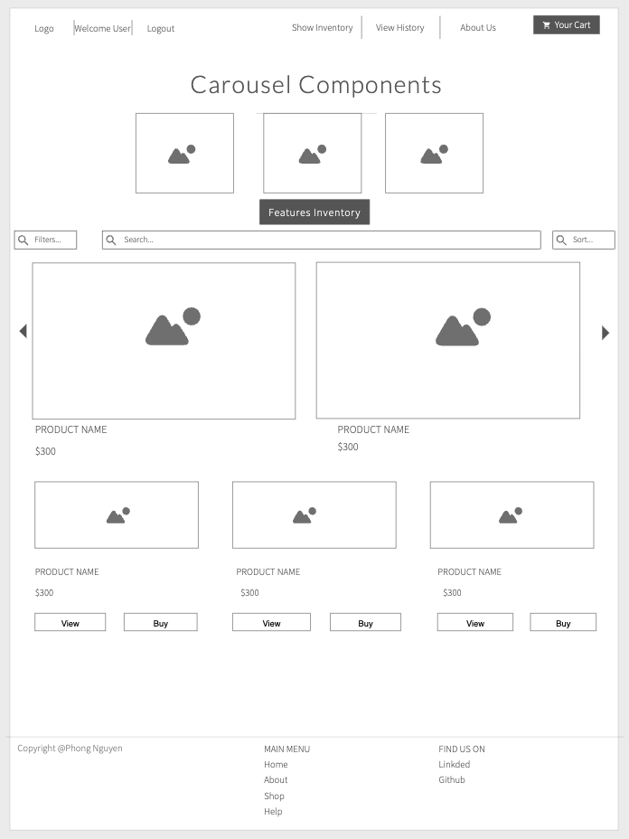

## `A Single-Page-Application(SPA) - MERN(MongoDB, Express, React and Node) Full Stack .`


### DESCRIPTION

```js
I'm using Full Stack JavaScript to design and develop an applications. 
This means I would be using Node, Express and MongoDB to design the REST APIs.
Then use those APIs in React frontend.
```

### Website Details 
```js
Japanese Auto Import website is a continuation from ProductsApp (project #2): 
So, the features I would be having in the application that would be building are:
  * Node provides the backend environment for this application
  * Authentication using JSON Web Tokens (JWT).
  * Option to add, edit, view and delete all the items in our store.
  * Option to add items or remove items from the cart.
  * Mongoose schemas to model the application data
  * React for displaying UI components
  * Adding Filter, Pagination, Search
  * Adding Shopping Cart
  * Handle Checkout & Payments
  * Deployment heroku
  * Using Cloudinary API & URL to upload images
  
Users & Admins Control:
1. USER:  browse the auto website:  categories, inventories, car model:  (cart and payment).
2. ADMIN:  Manage & Control the entire website components.
```
### Demo
- This application is deployed on Heroku. Please check it out :smile: [here](link).
- Please check it out my youtube live-demo:  [Youtube-Live-Demo](https://youtu.be/dX3sfDaacyw).


### Wire-frame



### Run the application for development
```
Back-end
$ npm run dev - http://localhost:3001/

```
### Run the application for production
```
Front-end
$ npm run start:dev - http://localhost:3000/
```


### Languages & Technologies 

- [Node](https://nodejs.org/en/) - [Express](https://expressjs.com/)
- [Mongoose](https://mongoosejs.com/) - [React](https://reactjs.org/)
- [HTML](https://html.com/) - [CSS](https://www.w3schools.com/Css/) 
- [JS](https://www.w3schools.com/js/default.asp) - [JWT USER AUTH](https://jwt.io/) 
- [Heroku](https://id.heroku.com/login) - [Postman](https://www.postman.com/)
- [VSCODE](https://code.visualstudio.com/) - [cloudinary](https://cloudinary.com//)


